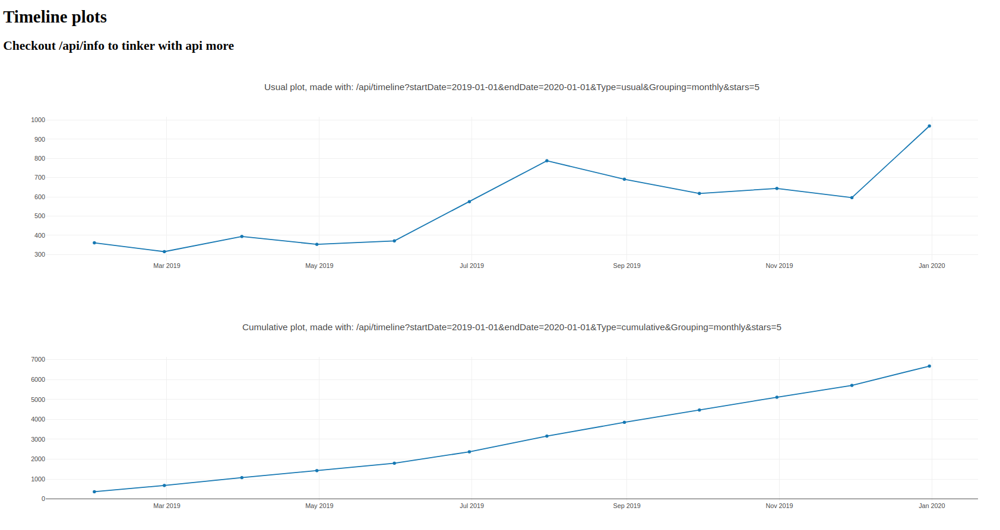
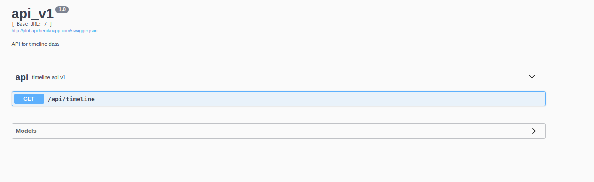

# Simporter task

## Project structure

- Project made using flask frameworks and flask-restx extension
- api_v1 package defines flask-restx Namespace for api routes
- plots package defines flask Blueprint, defines route which returns html page with plots visualization, calls api routes

## Heroku app 
(heroku app loads around 2 minutes) 

### Plots route
https://plot-api.herokuapp.com/plots

### Api documentation route
https://plot-api.herokuapp.com/api/info

Here you try to get data with various parameters 
